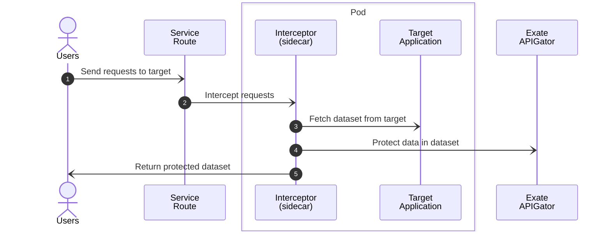

# Exate API-Gator Interceptor

Application build with [Quarkus][0] used for injecting [Exate's API-Gator][1] by intercepting requests to any
target application.



## Usage

- Configure and deploy the *Interceptor App* next to the *Target App*, preferably as a sidecar container.
- Redirect the *Target App*'s exposed service to the *Interceptor App*.

For any request, the *Interceptor App* will access the *Target App* and fetch the original dataset, it will then
send the dataset to *API-Gator*, and return the *Gator'ed* dataset as a response to the sender.

The *Interceptor App* image is pushed to [quay.io/ecosystem-appeng/gator-api-interceptor][3]

## Request Headers

All known headers from [APIGator Docs][2] can be added to the original request, and they will override headers in
APIGator requests. This allows users to override any headers per-request.

The following headers are unique to the *Interceptor App* and will not appear in [APIGator Docs][2].

| Header Key         | Description        | Required | Default Value |
|--------------------|--------------------|----------|---------------|
| Api-Gator-Bypass   | Bypass API Gator   | No       | false         | 

## Application Properties

> Visit [APIGator Docs][2] for possible values and types.

| Property Name                      | Environment Variable               | Required | Default Value                |
|------------------------------------|------------------------------------|:--------:|------------------------------|
| target.server.host                 | TARGET_SERVER_HOST                 |    No    | localhost                    |
| target.server.port                 | TARGET_SERVER_PORT                 |   Yes    |                              |
| target.server.secure               | TARGET_SERVER_SECURE               |    No    | false                        |
| api.gator.host                     | API_GATOR_HOST                     |    No    | api.exate.co                 |
| api.gator.port                     | API_GATOR_API                      |    No    | 443                          |
| api.gator.dataset-uri              | API_GATOR_DATASET_URI              |    No    | /apigator/protect/v1/dataset |
| api.gator.token-uri                | API_GATOR_TOKEN_URI                |    No    | /apigator/identity/v1/token  |
| api.gator.api-key                  | API_GATOR_API_KEY                  |   Yes    |                              |
| api.gator.client-id                | API_GATOR_CLIENT_ID                |   Yes    |                              |
| api.gator.client-secret            | API_GATOR_CLIENT_SECRET            |   Yes    |                              |
| api.gator.grant-type               | API_GATOR_GRANT_TYPE               |    No    | client_credentials           |
| api.gator.manifest-name            | API_GATOR_MANIFEST_NAME            |   Yes    |                              |
| %dev.api.gator.dataset-type        | API_GATOR_DATASET_TYPE             |   Yes    |                              |
| api.gator.job-type                 | API_GATOR_JOB_TYPE                 |   Yes    |                              |
| api.gator.country-code             | API_GATOR_COUNTRY_CODE             |   Yes    |                              |
| api.gator.data-owning-country-code | API_GATOR_DATA_OWNING_COUNTRY_CODE |    No    |                              |
| api.gator.data-usage-id            | API_GATOR_DATA_USAGE_ID            |    No    |                              |
| api.gator.protect-null-values      | API_GATOR_PROTECT_NULL_VALUES      |   Yes    |                              |
| api.gator.restricted-text          | API_GATOR_RESTRICTED_TEXT          |    No    |                              |
| api.gator.preserve-string-length   | API_GATOR_PRESERVE_STRING_LENGTH   |   Yes    |                              |
| api.gator.sql-type                 | API_GATOR_SQL_TYPE                 |    No    |                              |
| api.gator.classification-model     | API_GATOR_CLASSIFICATION_MODEL     |    No    |                              |
| api.gator.third-party-name         | API_GATOR_THIRD_PARTY_NAME         |    No    |                              |
| api.gator.third-party-id           | API_GATOR_THIRD_PARTY_ID           |    No    |                              |

## Local Container Run

> The following example only uses mandatory properties. View the above table for all properties.
> Use API-Gator documentation for the potential values and types.

```shell
podman run --rm -p 8082:8082 --network=host \
-e TARGET_SERVER_PORT='8080' \
-e API_GATOR_API_KEY='api-key-goes-here' \
-e API_GATOR_CLIENT_ID='client-id-goes-here' \
-e API_GATOR_CLIENT_SECRET='client-secret-goes-here' \
-e API_GATOR_MANIFEST_NAME='Employee' \
-e API_GATOR_DATASET_TYPE='JSON' \
-e API_GATOR_JOB_TYPE='DataMasking' \
-e API_GATOR_COUNTRY_CODE='GB' \
-e API_GATOR_PROTECT_NULL_VALUES='false' \
-e API_GATOR_PRESERVE_STRING_LENGTH='true' \
quay.io/ecosystem-appeng/gator-api-interceptor:tag-goes-here
```

<!-- Links -->
[0]: https://quarkus.io/
[1]: https://developer.exate.co/catalog/api/b49306b2-4040-429e-9306-b24040129ea1?aq=ALL
[2]: https://developer.exate.co/catalog/api/b49306b2-4040-429e-9306-b24040129ea1/doc
[3]: https://quay.io/repository/ecosystem-appeng/gator-api-interceptor
